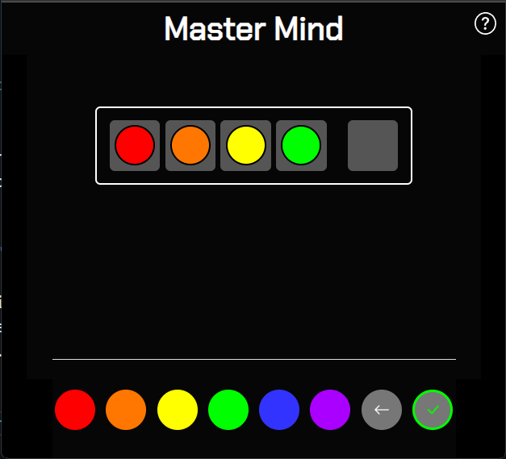
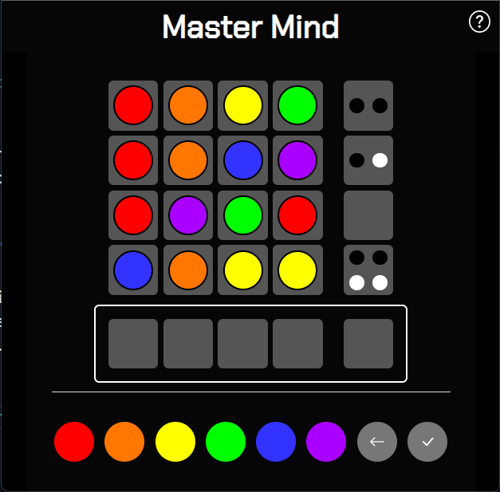

# Mastermind

My variation of the classic code breaker game of the same name.

---

## How to Play

When you start a game a random code of colors will be generated. The objective is to solve the code in ten guesses or less.

Difficulty can be adjusted by changing the number of colors used or the length of the code. Click Start Game to begin.

Using the buttons at the bottom, fill out the first section of the row and push the check mark (submit) button.

After you guess, the final block of the row will display black and / or white circles.
Each black circle indicates one of your guesses is the correct color and in the correct spot. Each white circle indicates one of your guesses is a correct color but in the wrong spot.
